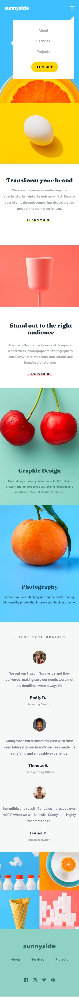

# Frontend Mentor - Sunnyside-agency-landing-page

Esta é uma solução para o [sunnyside-agency-landing-page](https://www.frontendmentor.io/challenges/sunnyside-agency-landing-page-7yVs3B6ef/). Os desafios do Frontend Mentor ajudam você a melhorar suas habilidades de codificação ao construir projetos realistas.

## Resumo de conteúdos

- [Visão Geral](#Visão-Geral)
  - [O desafio](#O-desafio)
  - [Captura de tela](#Captura-de-tela)
  - [Links](#Links)
- [Meu processo](#Meu-processo)
  - [Construído com](#Constrído-com)
  - [O que eu aprendi](#O-que-eu-aprendi)
  - [Continuação dos desenvolvimentos](#Continuação-dos-desenvolvimentos)
  - [Recursos utilizados](#Recursos-utilizados)
- [Autor](#Autor)

## Visão Geral.

### O desafio

Os usuários devem ser capazes de:

- Visualizar estados de foco para elementos interativos.
- Criação de uma landing page.
- Observar um design responsivo.

### Captura de tela

- Desktop
<p  align="center" >
  
</p>

- Tablet
<p  align="center" >

</p>

- Mobile
<p  align="center" >

</p>

- Mobile menu ativo
<p  align="center" >

</p>

- Gif
<p  align="center" >

</p>

### Links

- Solução URL: [https://github.com/michelwene/sunnyside-agency-landing-page](https://github.com/michelwene/sunnyside-agency-landing-page)
- Site URL: [https://michelwene.github.io/sunnyside-agency-landing-page/](https://michelwene.github.io/sunnyside-agency-landing-page/)

## Meu processo

### Construído com

- HTML5
- CSS3
- Flexbox
- Grid
- Design responsivo
- EMMET
- JavaScript

### O que eu aprendi

```css
@media screen and (max-width: 768px) {
  .menu__lista {
    align-items: center;
    color: var(--azul-acizentado);
    background-color: var(--branco);
    flex-direction: column;
    height: 19rem;
    opacity: 0; /* opacidade zero para fica tudo transparente*/
    position: relative;
    right: 18.7rem;
    top: 4.6rem;
    transition: all 0.5s ease-in-out;
    visibility: hidden; /*visibility hidden para não mostrar nada que estiver nesta classe*/
    width: calc(32.7rem - 12.5rem);
    z-index: -2;
  }

  .menu__lista::before {
    border-left: 25px solid transparent;
    border-right: 25px solid var(--branco);
    border-bottom: 25px solid transparent;
    border-top: 25px solid transparent;
    top: -1.5rem;
    content: "";
    height: 0;
    left: 84.6%;
    position: absolute;
    width: 0;
  }

  .show {
    opacity: 1;
    visibility: visible;
    /*após realizar o click no menu, esta classe é inserida na div da classe "menu__lista", onde pode se observar que ela coloca "visibility: visible e opacity: 1", esta funcionalidade só foi possível atravez da função no JS*/
  }
}

/*Esta duas classe eu diria resumidamente que proporcionou a amostragem do campo do menu ao clicar no menu "hamburguer".*/
/*Foi praticamente a mesma função que utilizei em um projeto anterior chamado Article-preview-component*/


@keyframes bounce {
  0%,
  20%,
  60%,
  100% {
    -webkit-transform: translateY(0);
    transform: translateY(0);
  }

  40% {
    -webkit-transform: translateY(-50px);
    transform: translateY(-50px);
  }

  80% {
    -webkit-transform: translateY(-10px);
    transform: translateY(-10px);
  }
}
/*Utilização de keyframes para dar um efeito na imagem da seta no banner do cabeçalho, nele podemos observer a seta "pingando", quando passamos o mouse por cima.*/

.descricao__leiaMais1::before {
  background: var(--amarelo);
  box-shadow: 0 0 5px var(--amarelo);
  border-radius: 10px;
  content: " ";
  display: block;
  height: 8px;
  left: -8px;
  opacity: 0.3;
  position: relative;
  top: 21px;
  width: 135px;
  z-index: -1;
}

.descricao__leiaMais1:hover::before {
  cursor: pointer;
  opacity: 1;
}

/*Neste css, representa a seta que fica embaixo do botão "Learn More", podemora observer que ele está anterior ao texto (este é a linha amarela), o outro que corresponde ao vermelho eu apenas troquei o background para vermelho e também sua box-shadow.*/
```

```javaScript
const hamburguer = document.querySelector(".menu");
const show = document.querySelector(".menu__lista");

hamburguer.addEventListener("click", function () {
  show.classList.toggle("show");
});

/*Basicamente esta é a função que utilizei para inserir um classe na div "menu__lista" onde inicialmente esta div esta com visibily: hidden e quando eu clico na seta ele coloca esta classe "show", onde no CSS ela esta com "visibily: visible" e "opacity: 1", ou seja, ela mostra para mim o menu.
E para selecionar o clique, eu adicionei um evento de "click" no ícone da seta no HTML e quando clicado ela chama a função acima.*/
```

### Continuação dos desenvolvimentos

Pretendo continuar fazendo projetos do FrontendMentor, para melhorar meu HTML, CSS, JavaScript.

### Recursos utilizados

- [Stackoverflow](https://stackoverflow.com/) - Este site me ajudou muito na realização das funções do javascript.
- [grid.layoutit](https://grid.layoutit.com/) - Site utilizado para fazer os template do css grid.
- [PerfectPixel](https://www.welldonecode.com/perfectpixel/) - Plugin do google Chrome utilizado para servir de refência na construção do layout, funciona mais ou menos como um FIGMA.

## Autor

- Frontend Mentor - [@michelwene](https://www.frontendmentor.io/profile/michelwene)
- Linkedin - [@michelwene](https://www.linkedin.com/in/michelwene/)
